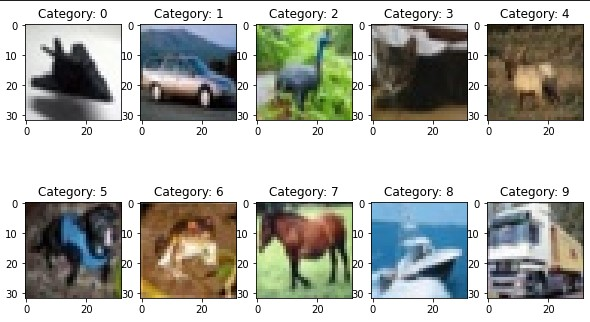

# ObjectIdentificationWithOpenCV

## Introduction

In this project, I used OpenCV to build an image classifiction model for differentiating a dataset with 10 labels, including horses, cars, boats, and planes.
  

## Experiments

I carried out 3 controlled experiments to explore aspects such as:

- Comparisons for different classifiers. 
- Tuning a hyper-parameter for a specific classifier.
- Different pre-processing methods, like normalization, extracting the edge features, grayscale, etc.   
- Ensembling, boosting, or voting methods.

The details of each experiment are as follows:

### Experiment 1:
I used feature extraction techniques in OpenCV to denoise the images and extract useful features from them. 

To be specific, I first made them grayscale (to reduce computational complexity) and then blurred them (to reduce noise). After this, I used the Canny Edge Detection algorithm to detect useful edges in my blurred pictures (to identify objects themselves in the images), and then did contour detection (to add some sort of hierarchy to the previously detected edges). Moreover, I also computed Histogram of Oriented Gradients for each image to make my model better understand it's anatomy.

After these preliminary steps, I standardized my images. Lastly, since training on this data took around 15 minutes for just one round, I used PCA to bring down the number of features while preserving the ratio of variance at 0.90 so only highly meaningful features are kept.

This step was done mainly to prepare my data for model testing since a few initial random runs on KNN or MLP yielded very poor results (~30% accuracy) and were in need of feature selection. However, testing the following models on different combinations of these preprocessing techniques produced different results. Some denoised the data so much that the model overfitted to it while others took way too much computational resources to train. Therefore, not all of these techniques were used in the final model

### Experiment 2:
I built a KNN here. Since KNNs are generally considered useful for image classification as they take into account the local relationship between features. However, my KNN didn't produce any promising results, with just approximately 45% accuracy on average, so I decided to build an MLP which would be more complex than just a KNN.

### Experiment 3:
Here, I built an MLP with 5 hidden layers with 200 nodes each. This configuration was achieved by iteratively testing out different quantities and combinations of layers and nodes. This produced rather promising results, with ~55% accuracy at the most, so I decided to use this as my final model.

## Final Model

In my final model, I used only the beneficial feature extraction, engineering, and decomposition tools that I had tested earlier.

The tested tools include making images grayscale, blurring them, detecting edges and contours, standardizing them, and finally extracting only essential features from them. 

However, in terms of benefits, only grayscale, HOG, and scaling proved to be useful since the others resulted in overfitting in my models. HOG was relatively computationally expensive but it also yielded better results, so the tradeoff was worth it. PCA resulted in a quicker prediction but the accuracy was reduced slightly, so the computational resources/model accuracy tradeoff was accounted for once more.

Therefore, I transformed my training and testing data by making it grayscale and generating HOGs for it, and ultimately fed all of this into my final tested MLP network (explained earlier)

## Conclusion and comments

My model obtained **56.4%** accuracy on the final test set, which was **among the top 10% of all submissions**. It can be improved by building a more complex MLP, or just by using a CNN. However, for learning purposes, I was instructed not to use CNN and understand the data thoroughly to exploit different features in it. Moreover, the resolution of the training images was also quite compromised so using a better and more refined training dataset could also help improve the model.
